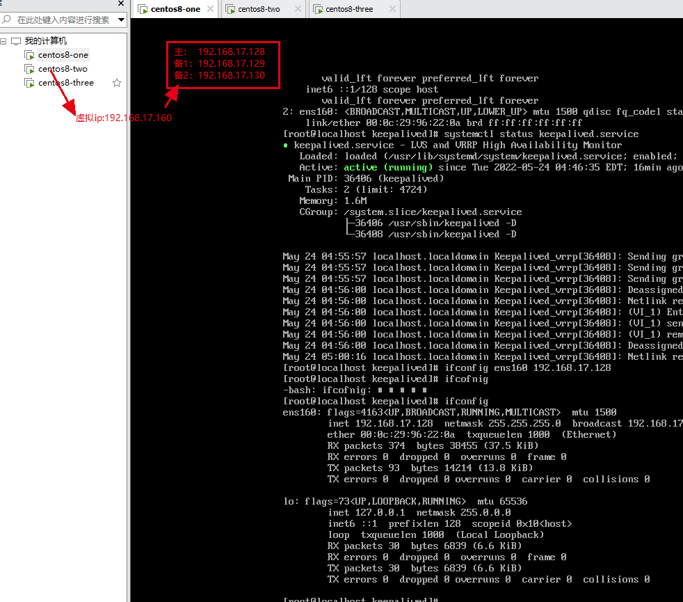
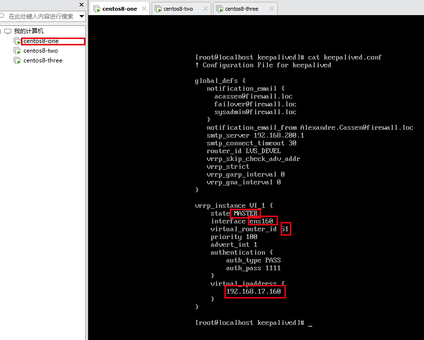
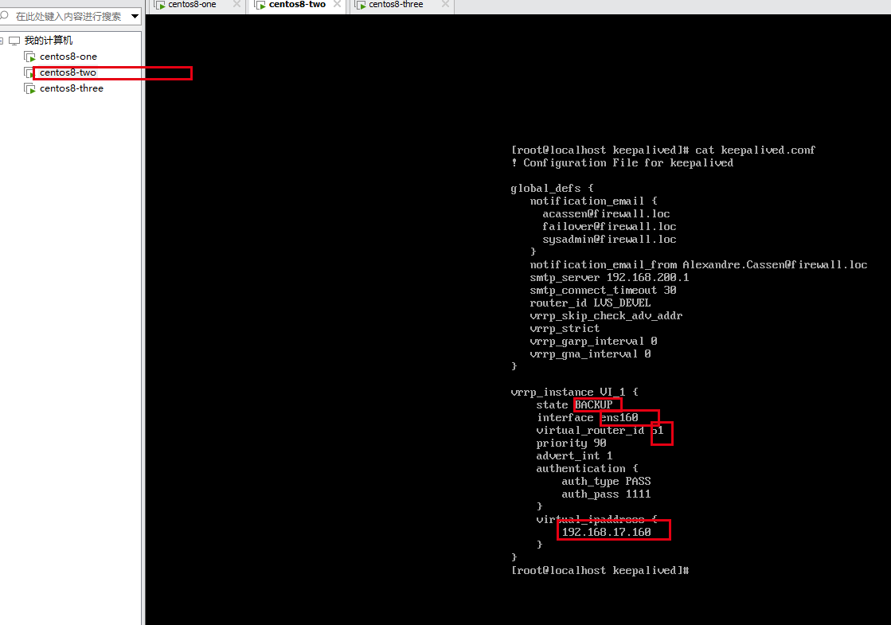
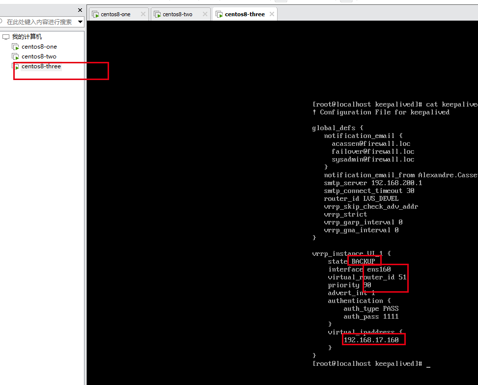
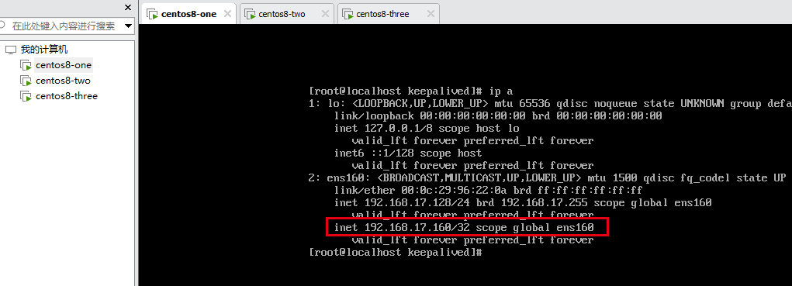

### 使用keepalived搭建一主二备的高可用服务
* 准备三台服务器
    
* 安装keepalived
```shell
    yum install keepalived
```
* 配置并启动keepalived
  - 配置三台服务器的ip
  ```shell
    centos8-one:   ifconfig ens160 192.168.17.128
    centos8-two:   ifconfig ens160 192.168.17.129
    centos8-three: ifconfig ens160 192.168.17.130
    ```
  - 配置三台服务器的keepalived配置
    - 查看keepalived配置文件的位置
    ```shell
      whereis keepalived
    ```
    - 修改配置
    ```shell
      vim /etc/keepalived/keepalived.conf
    ```
    * centos8-one
    
    * centos8-two
    
    * centos8-three
    
    
    - 启动keepalived
    ```shell
      systemctl start keepalived.service
    ```
    - 修改配置后重启
    ```shell
       systemctl restart keepalived.service
    ```
    - 设置keepalived开机自启动
    ```shell
       systemctl enable --now keepalived.service
    ```
* 查看配置好的服务器
  ```shell
    ip a
  ```
    - centos8-one
  
    表述当前虚拟ip正在centos8-one这台服务器上，停止centos8-one服务器，虚拟ip自动漂移到其他服务器上