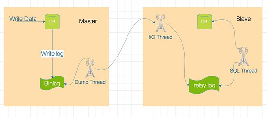
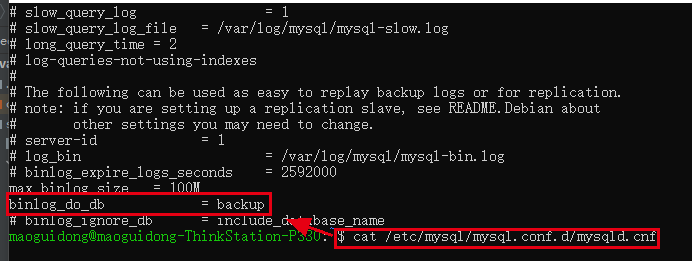
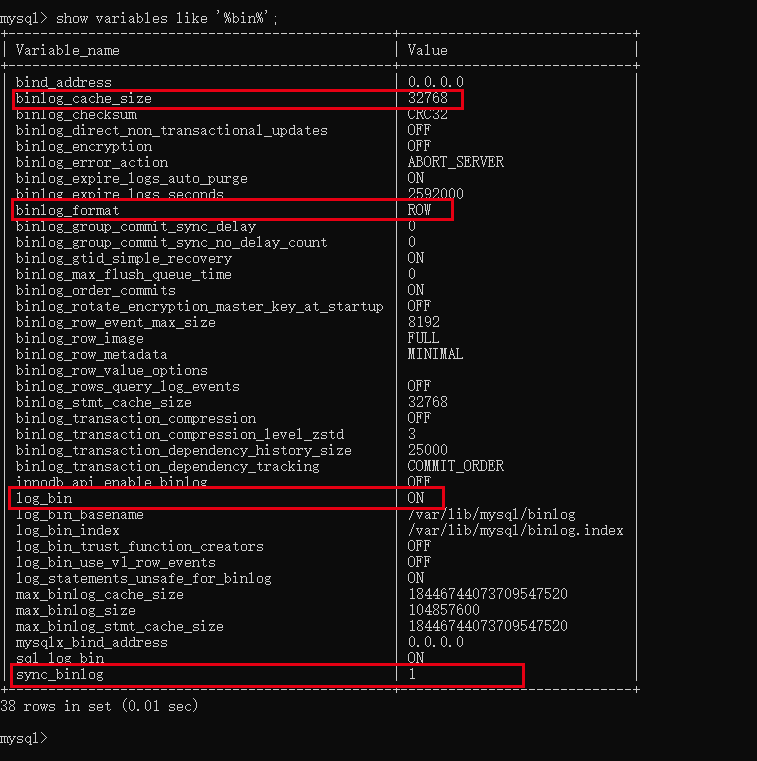
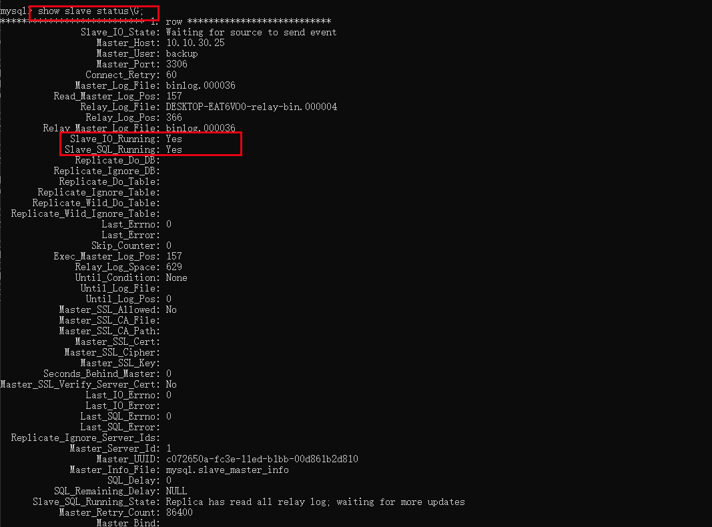
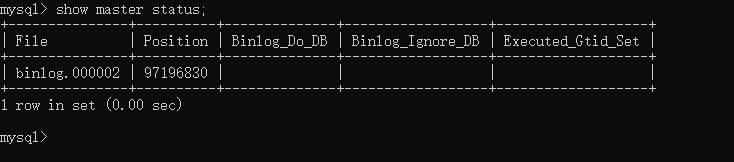

[回到主目录](/README.md)

## mysql主从复制架构图


## [mysql基础用户权限操作请参考](src/main/java/org/mgd/dataStruct/mysql用户权限操作.md)

## 主从服务器搭建过程
- a配置主服务器需要同步的数据库及同步的binlog格式




```shell
## 属性简介
binlog_cache_size:  32768  //用来在事务运行期间在内存中缓存binlog event
binlog_format:  ROW        //STATEMENT:记录操作记录,ROW:记录数据变更记录,MIXED:混合模式。如alter table语句表中有10条数据，使用STATEMENT时binlog只有一条记录，ROT时有10条记录，MIXED时可能有10条可能有1条。
1og_bin: ON                //是否开启binlog日志
sync_binlog:  1            //binlog日志写入时机，0-根据系统自动写入 1-每次事务提交写入
binlog_do_db= backup       //指定binlog 记录的数据库，有多个数据库时可以写binlog_do_db= d1  binlog_do_db= d2
```

- b在从服务器创建跟主服务器的同步的两个线程IO_THREAD和SQL_THREAD
```shell
change master to master_host='1.1.1.1',master_user='root',master_port='3306',master_password='root',master_log_file='binlog.000035',master_log_pos=1;
start slave;  //启动io和sql线程
```

##常用指令
- 查看系统binlog文件


- 查看当前binlog文件及指针位置和bingLog记录数据库


- master 相关操作
```shell
reset master;               重置binlog日志
```
- slave 相关操作
```shell
reset slave;                重置relaylog日志
stop slave;                 停止slave的io和sql线程
stop slave io_thread;       停止slave的io线程
stop slave sql_thread;      停止slave的sql线程
start slave;                重启slave的ip和sql线程
start slave io_thread;      重启slave的io线程
start slave sql_thread;     重启slave的sql线程
```