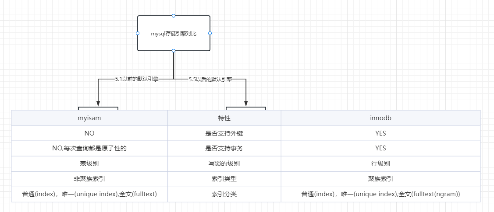
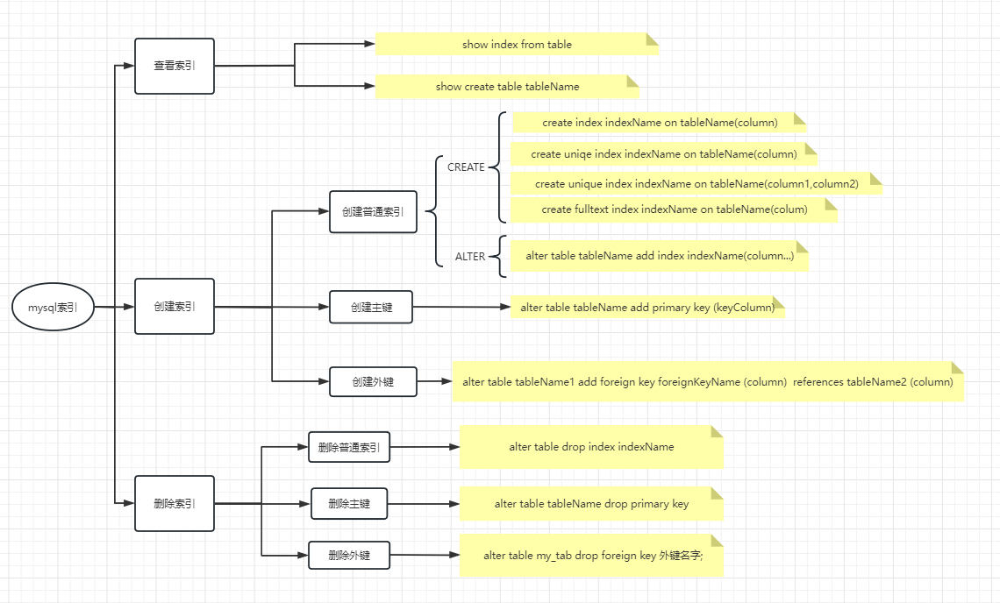
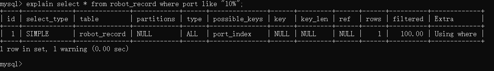

[回到主目录](/README.md)
## 索引基于数据库引擎的分类

## 索引的增删改

## 解析sql语句是否使用索引及性能情况

- ### explain 查询语句type类型说明
```shell
system：只有一行数据（这条记录是系统表中的一行），这是const类型的特例，平时不会出现。
const：通过索引一次就找到了，const用于比较primary key或者unique索引。因为只有一行数据，所以这个查询非常快。
eq_ref：使用唯一索引查询时，MySQL会将这个查询优化成const类型查询。eq_ref表示使用的是基于唯一索引的等值查询，通常出现在多表查询连接时，查询操作基于某个唯一索引，常见于主外键关系查询。
ref：使用非唯一索引查询来查找，返回所有匹配某个单独值的行。ref可以用来查找匹配某个值的记录，但只能查找到索引第一列的值，因此当对多列索引使用ref时，MySQL需要显式地输出使用了哪些索引。
range：通过索引范围查找，使用了索引的某个范围查询，例如使用between操作符。
index：全索引扫描，遍历整个索引查找匹配的行。一般来说，index类型优化不错，它通常出现在覆盖索引扫描时，即查询和返回的所有数据均从索引中获取。
all：完全扫描全表，查询将遍历全表查找匹配结果，查询效率较低。
```

