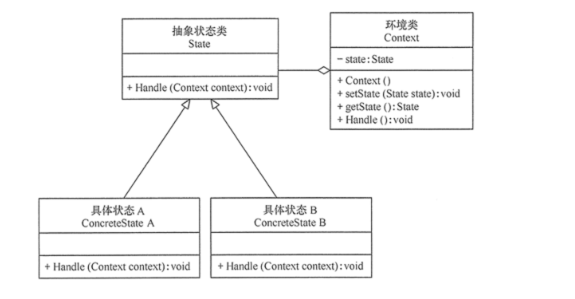

[回到主目录](/README.md)
# 1.fsm定义
```text
Final State Machine 有限状态机
```
# 2.fsm和状态模式的关系
- ## [2.1状态模式的代码示例](statePattern/StatePatternDemo.java)
- 
- ## [2.2fsm的代码示例](fsm/FsmDemo.java)
```text
1.有限状态机和状态模式是相似的，但是有限状态机更复杂，它需要一个状态机对象来管理状态，而状态模式则不需要。
2.有限状态机更关注的是状态之前的转换，而状态模式更关注不同状态所做的action
```
# 3.fsm的组件
```text

```