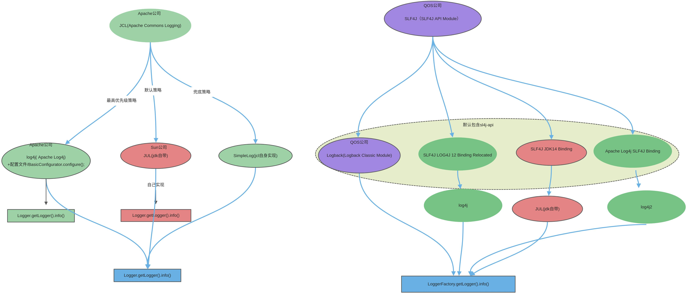

[回到主目录](/README.md)
# java日志体系
  ## java日志体系的演变
    ```shell
    #一阶段 LOG4J-->JUL-->JCL
        a-最开始的日志输出为JDK带的System.out和System.err
        b-log4j是俄罗斯Ceki Gülcü开发的后来捐给apache基金会，可支持文件和控制台输出.
        c-后来sun公司（jdk）也开发了款jul用于日志输出，不用另外导包开箱即用.
        d-随着两款日志框架的使用，为了不同项目间更好的管理，apache基金会又开发了一款日志门面技术JCL。

    #二阶段 LOGBACK-SLF4J-LOG4J2
        a-随着服务的发展，特别是微服物，系统资源紧缺，对日志的要求越来苛刻，要求日志尽可能少消耗系统资源
        b-logback是在log4j的作者Ceki Gülcü在apache离职后,创办QOS公司，在log4j的基础上重新构建，相对log4j更小，更快（10倍）官话：logback internals have been re-written to perform about ten times faster on certain critical execution paths. Not only are logback components faster, they have a smaller memory footprint as well.
        c-slf4j也是跟logback一起开发出来的产物,所以sl4j天然支持logback
        d-apache基金会在放弃log4j后，又重新整了一套log4j2(门面+实现)来对标Ceki的slf4j+logback
    ```


  ## java日志体系架构图

  
  ## Log4j2相关


  ## java日志收集
    ```shell
    head：从头开始查找日志
    tail：从尾开始查找日志
    cat：查看日志 -n 显示行号
    more：可分页显示日志 ctrl+f:forward  ctrl+b:back
    less：高效率分页显示日志
    grep：搜索日志并显示1行 -A 10 后10行 -C 10 上下10行 -B 10 前10行

    例如：查看日志log从头开始100行到200行的日志
        cat -n log | tail -n +100 | head -n 101
    ```