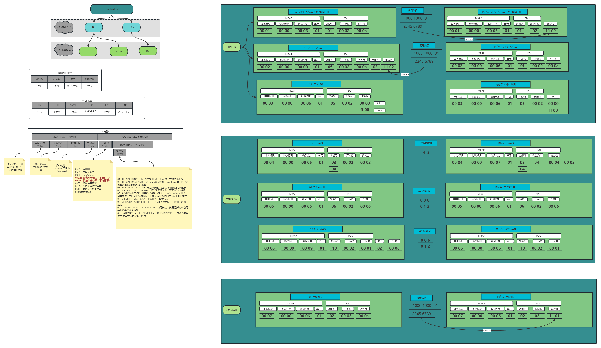

[回到主目录](/README.md)
# ModbusTCP协议
## 简介
```shell
    modbus由MODICON公司于1979年开发，是一种工业现场总线协议标准。1996年施耐德公司推出基于以太网TCP/IP的modbus协议：modbusTCP。

标准的Modbus协议物理层接口有RS232、RS422、RS485和以太网接口，采用master/slave方式通信，客户机作为主站，向服务器发送请求；服务器（从站）接到请求后，对请求进行分析并作出应答。

串口（RS232、RS422、RS485）: RTU/ASCII 
参数: 波特率、数据位、停止位和奇偶校验
```

## 常见错误

|CODE	|NAME	|描述|
|----|----|----|
|01	 |ILLEGAL FUNCTION  	|非法功能码，slave端不支持该功能码
|02	 |ILLEGAL DATA ADDRESS  	|非法数据地址，master端请求的数据范围超出slave端设置的范围
|03	 |ILLEGAL DATA VALUE  	|非法数据值，提交存储的数值范围超长
|04	 |SERVER DEVICE FAILURE  	|服务器运行时发生不可恢复的错误
|05	 |ACKNOWLEDGE  	|服务器已接受该请求，正在运行正在处理它，但需要很长的时间必须这样做。此响应返回给防止在中发生超时错误
|06	 |SERVER DEVICE BUSY  	|服务器处于繁忙状态
|08	 |MEMORY PARITY ERROR  |内存奇偶校验错误，一般用于功能20/21
|0A	 |GATEWAY PATH UNAVAILABLE  	|与网关结合使用,通常意味着网关配置错误或者超载。
|0B	 |GATEWAY TARGET DEVICE FAILED TO RESPOND  	|与网关结合使用,通常意味着设备不可用

## 一图详解  

