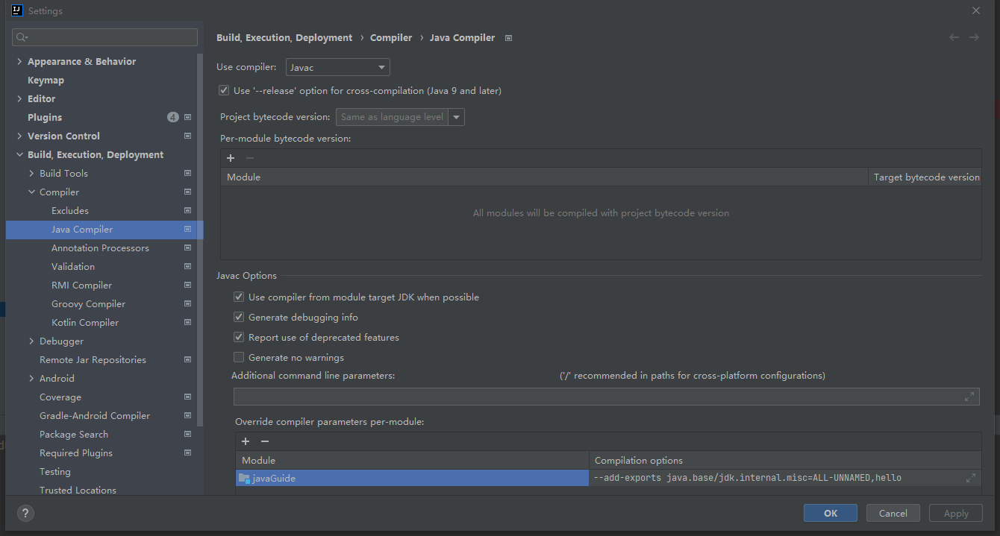

#[回到主页](/README.md)
***
## Unsafe类的作用和基础知识 
***
***1. Unsafe类的背景***  
***

1. *java模块信息*
```text
jdk为了代码安全，防止一些核心模块被其他类访问
JDK9之后，java新增了模块化特性
# 查看模块列表
java --list-modules
# 查看具体模块信息:如java.base模块
java --describe-module java.base
```
2. *自定义模块*
```text
在src/main/java/module-info.java 新增自定义模块
```
```html
module hello {
    requires jdk.unsupported;//引入jdk.unsupport模块
    requires java.base; //引入java.base模块
    requests transitive D; //继承引入D同时引入E,F。
    exports org.mgd.aop to java.base,java.desktop; //导出模块并设置指定模块可以用
}
module D {
    requires E; 
    requires F;
}
```
3. *模块导入*
```text
正常在java中引入Unsafe类会报错，因为java.base模块未对外开放
可以在idea编译器中增加配置：--add-exports java.base/jdk.internal.misc=ALL-UNNAMED,hello
```

4. *模块运行*
```text
error: because module java.base does not export jdk.internal.misc to
增加了编译时的配置，不报错，当运行时会二次校验，所以需要在运行配置增加jvm参数
配置参数：--illegal-access=deny --add-opens java.base/jdk.internal.misc=ALL-UNNAMED,hello

--illegal-access
该参数有四个可选值：
permit：默认值，允许通过反射访问，因此会提示像上面一样的警告，这个是首次非法访问警告，后续不警告
warn：每次非法访问都会警告
debug：在warn的基础上加入了类似e.printStackTrace()的功能
deny：禁止所有的非法访问除了使用特别的命令行参数排除的模块，比如使用--add-opens排除某些模块使其能够通过非法反射访问

注意在maven项目中添上如上jvm启动参数可以，但是在gradle项目中需要手动添加启动参数
需要使用gradle
java --illegal-access=deny --add-opens java.base/jdk.internal.misc=ALL-UNNAMED,hello -classpath  D:\idea\ideaIC-212.4321.30.win\lib\idea_rt.jar -p D:\ideaprojects\javaGuide\out\production\javaGuide -m hello/org.mgd.unsafe.UnsafeApp
```
5. *Unsafe类的演变*
```text
在JDK8及以前，Unsafe类存在sun.misc包下面
JDK9之后，jdk引入了模块化概念，Unsafe类被分到java.base模块下jdk.internal.sun.misc包下面命令为jdk.internal.sun.misc.Unsafe和jdk.unsupport模块下面命名为sun.misc.Unsafe  

sun.misc.Unsafe 和 jdk.internal.misc.Unsafe 都是 Java 中的类，但是它们之间有一些关键的区别。
sun.misc.Unsafe 是 JDK 8 及以下版本中提供的一个不稳定的 API，用于在 Java 中访问底层操作系统功能。这个类最初是为了实现 Java 库中的高性能数据结构和并发算法而设计的。然而，由于该类的使用不受 Java 语言规范的限制，并且可以轻松地绕过 Java 安全管理器，所以它已经被标记为不稳定的 API，并可能在任何时间被取消。
jdk.internal.misc.Unsafe 是 JDK 9 引入的替代 sun.misc.Unsafe 的方式，它仅用于 JDK 内部，并用于 JDK 实现和 Java 类库。它不推荐用于应用程序级别的编程，因为它被标记为受保护的 API，可能在任何时间修改或删除。
因此，虽然 sun.misc.Unsafe 和 jdk.internal.misc.Unsafe 都提供了类似的功能，但它们之间的主要区别在于可用性和稳定性，开发者应该尽量避免使用它们。
```
***
***

***2. Unsafe类的常用法和实例***
 ```mermaid 
 graph TB
    Unsafe-->内存操作-->ByteBuffer.allocateDirect
    Unsafe-->CAS-->AtomicInteger
    Unsafe-->Class相关-->jdk的AOP
    Unsafe-->内存屏障-->StampedLock
    Unsafe-->线程调度-->park,unpark,monitorEnter,monitorExit,tryMonitorEnter
 ```
