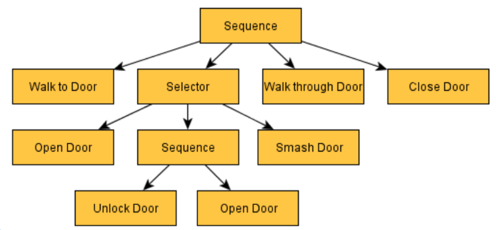

[回到主目录](/README.md)
## 机器人学和人工智能中的行为树
- [机器人学和人工智能中的行为树pdf-中文翻译](机器人学和人工智能中的行为树.pdf)

---

## 1 节点通用性质
- ### 1.1 执行流程
```text
1. 节点从根节点开始执行
2. 父节点控制子节点的执行顺序
3. 节点的返回 节点状态 BtNodeStatus
```
| 节点状态 | BtNodeStatus | 说明      |
|------|--------------|---------|
| 运行中  | RUNNING      | 节点还在运行中 |
| 成功   | SUCCESS      | 运行成功    |
| 失败   | FAILURE      | 运行失败    |
```text
1. 节点返回给父节点
2. 节点瞬时执行，不阻塞
3. 根节点返回 成功 或 失败 整个行为树结束；根节点返回 运行中 ，进行下一次循环
```
- ### 1.2 黑板
预设的黑板属性 ：

| 属性名           | 类型   | 说明           | 赋值时机               |
|------------------|--------|----------------|------------------------|
| vehicleGroupKeys | 数组   | 所属车组Keys   | 订单分配车后设置        |
| vehicleKey       | 字符串 | 车Key          | 订单分配车后设置        |
| taskKey          | 字符串 | 订单Key        | 行为树初始时            |
| subTaskKey       | 字符串 | mission_key    | 执行相应子任务时        |
| curMapName       | 字符串 | 地图名         | AgvMove节点执行完成     |
| curStationId     | 整型   | 站点ID         | AgvMove节点执行完成     |
- ### 1.3 通用属性
|属性名| 是否必须 | 类型  |说明|
|-|-|-----|-|
|desc| 否  | 字符串 | 描述|
## 2 节点分类
| 分类     | 功能                 | 是否叶子节点 | 子节点数量 |
|----------|----------------------|--------------|------------|
| 控制节点 | 组合节点，控制流程逻辑 | 否           | >= 1       |
| 动作节点 | 具体执行动作的节点    | 是           | 0          |
| 装饰节点 | 影响子节点结果        | 否           | 1          |

<hr/>

- ### 2.1 控制节点
- #### 2.1.1 🌟 顺序节点 [ Sequence]
```text
参数： 无
功能：控制子节点顺序执行
举例: 
```
```xml
    <Sequence >
        <ActionA name="action_when_var_eq_1" />
        <ActionB name="action_when_var_eq_42" />
        <ActionC name="action_when_var_eq_666" />
        <ActionD name="default_action" />
    </Sequence>
```
```text
执行流程：
    1. 子节点返回 成功
      - 如果是最后一个子节点， 返回 成功
      - 如果还有下一个子节点，执行下一子节点，返回 运行中
    2. 子节点返回 失败
      - 直接返回 失败
    3. 子节点返回 运行中
      - 返回 运行中 , 下一次循环继续执行 此子节点
```
---
- #### 2.1.2  🌟策略节点 [ Fallback]
```text
参数： 无
功能：用于尝试不同的策略，直到一个策略成功
举例:
```
```xml
<Fallback >
    <ActionA />
    <ActionB />
    <ActionC />
    <ActionD />
</Fallback>
```
```text
执行流程:
1. 子节点返回 SUCCESS
  - 直接返回 SUCCESS
2. 子节点返回 FAILURE
  - 如果是最后一个子节点， 返回 FAILURE
  - 如果还有下一个子节点，执行下一子节点，返回 RUNNING
3. 子节点返回 运行中
  - 返回 运行中 , 下一次循环继续执行 此子节点
```

---
- #### 2.1.3 🌟并行节点 [ Parallel]
参数：

|参数| 类型  |说明|
|-|-----|-|
|success_count| int |触发SUCCESS需要成功子节点的数量|
|failure_count| int | 触发FAILURE需要失败孩子的数量 |

功能:
```text
 并发地执行它的所有子节点，不需要所有子节点执行完
```
举例:
```xml
<Parallel success_count="2" failure_count="3">
    <ActionA />
    <ActionB />
    <ActionC />
    <ActionD />
</Parallel>
```
```text

```
---
- #### 2.1.4 🌟并行所有节点 [ ParallelAll]
参数：

|参数 |类型 |说明 |是否必需 |默认值
|-|-----|-|-|-|
|max_failures|int|如果返回FAILURE的子节点数超过这个值，返回FAILURE|否|1

功能：
```text
并发地执行它的所有子节点，需要所有子节点执行完； 超过失败数失败，否者成功
```
举例：
```xml
<ParallelAll max_failures="3">
    <ActionA />
    <ActionB />
    <ActionC />
    <ActionD />
</ParallelAll>
```
---
- #### 2.1.5 🌟反应式顺序节点 [ ReactiveSequence]
参数：无

功能：
```text
此节点对于持续检查条件特别有用  顺序执行子节点
```
举例：
```xml
<ReactiveSequence>
    <ConditionA />
    <ActionA />
</ReactiveSequence>
```
执行流程:
```text
- 如果子节点返回RUNNING，则再从该子节点的第一兄弟开始执行
- 如果子节点返回SUCCESS，则执行该子节点的下一个兄弟节点
- 如果子节点返回FAILURE，停止并返回FAILURE
```
---
- #### 2.1.6 🌟有记忆的顺序节点 [ SequenceWithMemory]
参数：无
功能：
```text
顺序执行子节点；如果再次循环，成功的节点不会在执行
```
举例：
```xml
<SequenceWithMemory>
    <ActionA />
    <ActionB />
    <ActionC />
    <ActionD />
</SequenceWithMemory>
```
---
- #### 2.1.7 🌟分支节点 [Switch]
参数： 

| 参数      | 类型   | 说明               | 是否必需 |
|-----------|--------|--------------------|----------|
| variable  | string | 黑板里的变量名     | 是       |
| case_1    | string | 第1个分支的匹配值  | 是       |
| case_n    | string | 第n个分支的匹配值  | 否       |
功能：
```text
SwitchNode相当于一个switch语句，其中根据黑板条目的值执行某个分支(子)
注意，同样的行为可以通过多个序列、回退和条件读取黑板来实现，但switch更短，更可读。
```
举例：
```xml
<Switch variable="var"  case_1="1" case_2="42" case_3="666" >
    <ActionA name="action_when_var_eq_1" />
    <ActionB name="action_when_var_eq_42" />
    <ActionC name="action_when_var_eq_666" />
    <ActionD name="default_action" />
</Switch>
```
---
- #### 2.1.8 🌟判断节点 [IfThenElse]
参数：无

功能：
```text
执行流程:
1. 第一个子节点是if的'语句'
  - 如果返回SUCCESS，则执行第二个子节点
  - 相反，如果它返回FAILURE，则执行第三个子节点
2. 如果只有2个子节点，则第一节点将在语句返回FAILURE时返回FAILURE，这相当于将AlwaysFailure添加为第三个子节点
```
举例：
```xml
<IfThenElse>
    <Condition />
    <ActionA />
    <ActionB />
</IfThenElse>
```
---
- #### 2.1.9 🌟 顺序挂起点 [ HangSequence]
```text
参数： 无
功能：同顺序节点；扩展了挂起点记录,子节点失败后订单挂起，再点击继续和跳过时，不是从失败的子节点开始，而是从HangSequence开始
执行流程: 同顺序节点
举例:
```
```xml
<HangSequence >
    <ActionA />
    <ActionB />
    <ActionC />
    <ActionD />
</HangSequence>
```
```text

```
---
- <hr/>
- ### 2.2 装饰节点
- #### 2.2.1 ✨强制失败 [ForceFailure]
参数：无

功能：
```text
强制返回失败，总是返回FAILURE或RUNNING
```
举例：
```xml
<ForceFailure>
    <ActionA />
</ForceFailure>
```
---
- #### 2.2.2 ✨强制成功 [ForceSuccess]
参数：无

功能：
```text
强制返回成功， 总是返回SUCCESS或RUNNING
```
举例：
```xml
<ForceSuccess>
    <ActionA />
</ForceSuccess>
```
---
- #### 2.2.3 ✨取反节点 [ Inverter]
参数：无

功能：
```text
取反子节点状态 
- 如果子节点失败，则返回SUCCESS
- 如果子节点成功，则返回FAILURE
- 保持RUNNING状态
```
举例：
```xml
<Inverter>
    <ActionA />
</Inverter>
```
---
- #### 2.2.4 ✨重试节点 [ RetryUntilSuccessful]
参数：

| 参数         | 类型 | 是否必需 | 说明     |
|--------------|------|----------|----------|
| num_attempts | int  | 是       | 重试次数 |
功能：
```text
用于在子节点失败时多次执行子节点。
- 如果子节点返回SUCCESS，则循环停止，该节点返回SUCCESS。
- 如果子节点返回FAILURE，则该节点将重试最多N次(N从参数“num_attempts”读取)
```
举例：
```xml
<RetryUntilSuccessful num_attempts="3">
    <ActionA />
</RetryUntilSuccessful>
```
---
- #### 2.2.5 ✨延迟节点 [ Delay]'
参数：

| 参数       | 类型 | 是否必需 | 默认值 |
|------------|------|----------|--------|
| delay_msec | int  | 否       | 2000   |
功能：
```text
延迟节点将引入一个延迟，然后执行子节点，返回子节点在完成时的状态。
延迟以毫秒为单位，使用参数"delay_msec"传递
在延迟期间，节点状态变为RUNNING
```
举例：
```xml
<Delay delay_msec="1000">
    <ActionA />
</Delay>
```
---
<hr/>

- ### 2.3 动作节点
- #### 2.3.1 ⭐总是成功节点 [ AlwaysSuccess]
参数：

功能：
```text
总是返回SUCCESS的简单操作
```
举例：
```xml
<AlwaysSuccess />
```
---
- #### 2.3.2 ⭐总是失败节点 [ AlwaysFailure]
参数：

功能：
```text
总是返回FAILURE的简单操作
```
举例：
```xml
<AlwaysFailure />
```
---
- #### 2.3.3 ⭐黑板写值节点 [ SetBlackboard]
参数：

| 参数       | 类型   | 是否支持变量 | 说明     |
|------------|--------|--------------|----------|
| output_key | string | 不支持       | 属性名   |
| value      | string | 支持         | 属性值   |
功能：
```text
将字符串“42”存储在键为“the_answer”的条目中
```
举例：
```xml
<SetBlackboard value="42" output_key="the_answer" />
```
---
- #### 2.3.4 ⭐黑板值比较节点 [Eq]
参数：

| 参数  | 类型   | 是否必需 | 说明   |
|-------|--------|----------|--------|
| key   | string | 是       | 属性名 |
| value | string | 是       | 属性值 |

功能：
```text
比较“paused”的条目中值是否等于"false"
```
举例：
```xml
<Eq key="paused" value="false"/>
```
---
- #### 2.3.5 ⭐比较表达式节点 [Expression]
参数：

| 参数        | 类型   | 是否必需 | 说明                           |
|-------------|--------|----------|--------------------------------|
| expression  | string | 是       | aviator脚本 表达式，布尔表达式 |
功能：
```text
根据表达式计算黑板值

aviator官网 http://fnil.net/aviator/
aviator github https://github.com/killme2008/aviatorscript
aviator脚本文档 https://www.yuque.com/boyan-avfmj/aviatorscript/yc4l93
```
举例：
```xml
<Expression expression="include(vehicleGroupKeys, 'group-0001')"/>
```
---
- #### 2.3.6 ⭐AGV移动节点 [ AgvMove]
参数：

| 参数      | 类型   | 说明             | 是否支持变量 | 是否必需 |
|-----------|--------|------------------|--------------|----------|
| id        | string | 对应mission_key  | 不支持       | 否       |
| mapId     | int    | 地图ID           | 支持         | 是       |
| stationId | int    | 站点ID           | 支持         | 是       |
功能：
```text
AGV移动到地图1的站点30.
```
举例：
```xml
<AgvMove mapId="1" stationId="30"/>

<AgvMove mapId="{xmap}" stationId="{xid}"/>
```
---
- #### 2.3.7 ⭐AGV动作节点 [ AgvAct]
参数：
功能：
```text
agv执行动作
```
举例：
```xml
<AgvAct actionName="startCharging" actionType="standardRobotsCustom">
    <properties id="4" param0="1" param1="0" param_str="-"/>
</AgvAct>
```
---
- #### 2.3.8 ⭐中控回调请求节点 [ HttpAct]
参数：

| 参数                  | 类型   | 说明               | 是否必需 | 支持变量 | 默认值         |
|-----------------------|--------|--------------------|----------|----------|----------------|
| url                   | string | 请求地址           | 是       | 支持     |                |
| retryCount            | int    | 重试次数           | 否       | 不支持   | 5              |
| backoffDelay          | int    | 重试延时           | 否       | 不支持   | 3000           |
| successResultCode     | int    | 成功code码         | 否       | 不支持   | 200            |
| aheadErrorResultCode  | int    | 快速异常码         | 否       | 不支持   | 886            |
| forceSuccess          | bool   | 强制成功           | 否       | 不支持   | false          |
| bbParam               | string | 黑板参数           | 否       | 不支持   |                |
| properties            | {}     | 扩展携带属性       | 否       | 支持     |                |
| out                   | sring  | 请求相应写入黑板   | 否       | 不支持   |                |
| waitPassResultCode    | int    | 等待放行码         | 否       | 不支持   | 201            |
| waitPassDelay         | long   | 等待放行超时时间   | 否       | 不支持   | 12 * 360_0000  |
功能：
```text
执行POST请求，请求地址“ http://10.16.75.56:8888/test” , 重试5次，重试延时3秒，如果请求返回 { code: 886 }, 不重试，请求body 携带信息 （bbParam和properties，bbParam 可以包含当前节点执行时，黑板里的任何参数 ）
如果请求成功 { code: 200 } 返回成功；否者 返回失败。
如果请求响应是:
{
    "code": 200,
    "message": "",
    "data": {
        "mes": {
            "a": 1,
            "b": 2
        },
        "end": true
    }
}
```
举例：
```xml
<HttpAct url="http://10.16.75.56:8888/test" />
<HttpAct
url="http://localhost:7888/test_rest_20"
retryCount="5"
backoffDelay="3000"
successResultCode="200"
aheadErrorResultCode="886"
waitPassResultCode="201"
waitPassDelay="3600000"
bbParam="vehicleKey,taskKey,subTaskKey,curMapName,curStationId"
forceSuccess="false"
out="mesA = mes.a, mesB = mes.b, isEnd = end">
<properties a="0" b="1"/>
</HttpAct>
<HttpAct url="{test_url}">
<properties a="{mesA}" b="{mesB}"/>
</HttpAct>
```
---
## 3. XML格式示例
```xml
<?xml version="1.0" encoding="UTF-8" standalone="no"?>
<root  BTCPP_format="4" mainTreeAttribute="MainTree">
    <BehaviorTree  ID="MainTree">
        <Sequence>
            <AgvMove mapId="3" stationId="12"/>
            <AgvAct actionName="startCharging" actionType="standardRobotsCustom">
                <properties id="4" param0="1" param1="0" />
            </AgvAct>
        </Sequence>
    </BehaviorTree>
</root>
```