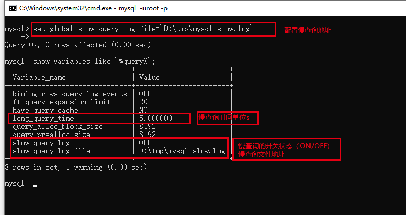
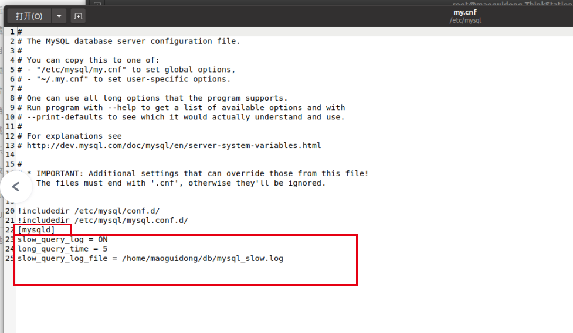
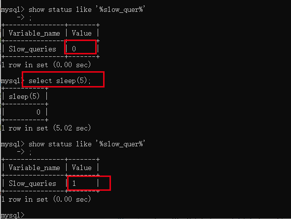

[回到主目录](/README.md)

# mysql慢查询


- mysql慢查询相关参数
```text
    登录mysql:
    查看慢查询相关参数：show variables like '%query%'
    设置mysql慢查询参数：
        - set global long_query_time=5;
        - set global slow_query_log=ON;
        - set global slow_query_log_file=`D:\tmp\*.log`;
```
- mysql慢查询设置long_query_time无效
```text
    其实设置已经生效，只作用于新的连接，故关闭当前连接新建连接可查看已经修改生成
```
- 系统重启mysql慢查询配置失效
```text
    set global *=*,此类配置只作用于当前用户空间，重启系统或重启mysql配置失效果。
    如果需要重启mysql也生效需要在mysql启动配置文件my.cnf中添加相关配置。
```
- 通过系统配置让mysql慢查询重启也生效
```text
    linux中，在/etc/my.cnf或/etc/mysql/my.cnf中配置
```


```text
    windows中，在mysql安装目录下的my.ini
```


- 慢查询测试
```text
    1、开启慢查询
    2、测试慢查询记录 select sleep(5),睡5s
    3、查看慢查询记录条数 show status like '%slow_queries%'
```


# mysql定时事件
- 查看定时任务开关
```text
    //查看定时线程开关
    show variables like '%event%';
    //开启关闭订单任务
    SET GLOBAL event_scheduler = ON/OFF;
    //查看定时任务执行情况
    select * from information_schema.events;
    show events;
```
- 设置定时任务
```text
    -- 示例：每小时更新一次
    create event myevent
        on schedule at current_timestamp + interval 1 hour
        do
      select count(*) from xxx;
    -- 示例：每天晚上00点更新
    create event every_day
        on schedule 
            every 1 day starts '2022-12-09 00:00:00'
        do
    select count(*) from xxx;
```
# mysql当前连接
- 查看当前连接数
```text
    //查看支持的最大连接数
    show varialbes like '%max_connect%';
    //查看当前连接数
    show status like '%connect%';
```
- 查看当前连接在干嘛
```text
    //查看所有的链接信息-简单
    show processlist;
    //查看所有的链接信息-详细
    show full processlist;
    //查看所有的链接信息-详细
    select * from information_schema.processlist;
```
- kill当前连接
```text
    //id为线程id
    kill id
```
# mysql binlog日志
- 默认情况下mysql的 bing log 日志是永久保存，可能导致磁盘爆满
- 修改bing log日志保存天数为3天并清空当前bing log日志
```text
 - 配置mysql的bin log日志保存时间
    [mysqld]
    expire_logs_days=3
    binlog_expire_logs_seconds=0 //mysql8.0以上此处需要设备为0 上面的才生效
 - 重置bin log 日志
    reset master
```