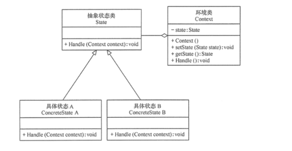
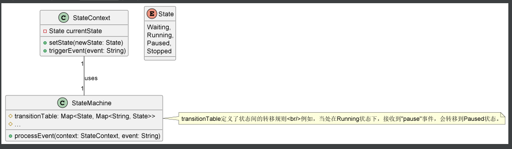
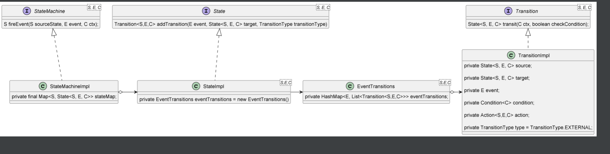

[回到主目录](/README.md)

# 1.fsm定义

```text
Final State Machine 有限状态机
```

# 2.fsm和状态模式的关系

- ## [2.1状态模式的代码示例](statePattern/StatePatternDemo.java)
- 
- 上图中的Handle起始就是导致状态变化的action方法，注意action需要带参数context

- ## [2.2fsm的代码示例](FsmDemo.java)
- 

- ## 2.3策略模式vs状态模式vs状态机
```text
1-策略模式和状态模式UML类图基本上一样的，所以代码也是相似的，两种模式其实可以互相转化，但是处理问题场景不同
    策略模式：适用于 策略的实现类很多，而行为handle方法很少（一般只有一个）的场景【如支付方式：支付宝、微信、银联 的支付行为】
    状态模式：适用于 策略时实现类较少，行为handle方法比较多的场景【如订单状态：待支付、待发货、待收货、已完成、已取消的支付，发货，收货，退货等行为】
2-状态模式和状态机，状态机基于状态模式的优化版本，解决了状态模式中无用action臃肿问题
    状态优化：使用枚举表示状态，减少新增状态时需要新建状态实现类，减少实现没必要的action
    行为优化：
```

# 3.fsm的常用组件
- ### squirrel状态机（github star 最高）
- ### cola中的状态机（无状态，高性能）

- ### spring中的状态机(使用注解很好兼容spring)
