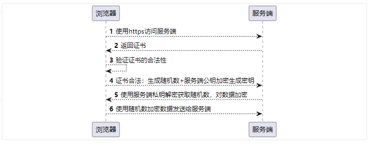

[回到主目录](/README.md)
# Https方案
---
## 整体流程

## SpringBoot实现
- ### 修改配置文件，开启ssl加密
```text
server:
  port: 8089
  ssl:
    protocol: TLS
    key-store: "classpath:springtest.jks" #指定证书位置,keystore证书库类似数据库文件
    key-store-password: javastack #服务私钥
    key-store-type: JKS #证书类型
```
- ### 生成自签证书
```text
使用java自带的keytool.exe生成自签证书
```
```text
keytool -genkeypair -alias springtest -keyalg RSA -keysize 2048 -keypass springtest -validity 1000 -keystore D:\springtest.jks -storepass springtest
keytool 生成密钥对 别名 加密方式 加密长度 密钥 时效 密钥库 密钥库密码
```