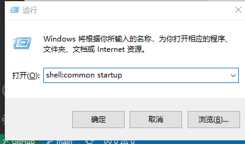

[回到主目录](/README.md)
# windows服务注册和开机自启
---

## .bat和.exe文件的区别
```java
        都是可执行文件，.bat是dos编写的脚本语言，.exe是二进制文件没有可读性，适合作用于windows安装包，安全。两者都能双击被执行，只是解析执行器不同，其作用是相同的。

```
## 设置环境变量的两种方式
```java
        set PATH=xxx\xx\bin    //配置当前环境临时环境变量
        setx path "xx\xx\bin"   //配置当前用户永久环境变量
        setx path "xx\xx\bin" /m   //配置系统永久环境变量
```
## windows安装包
借助工具inno_setup制作windows安装包
<br>
[inno_setup 安装包的iss文件示例](win/mrs.iss)
<br>
[安装之后的启动文件示例](win/install.bat)
<br>
[Code的Pascal语法](https://jrsoftware.org/ishelp/)

## windows服务
- ### 常用指令
```java
        sc.exe create 服务名 binPath="xx/xx/xx.exe" start=auto  //服务注册
        sc.exe delete 服务名    //服务删除
        net start 服务名        //启动服务
        net stop 服务名         //停止服务
        net restart 服务名      //重启服务
```
- ### 注册windows服务
 可借助工具winws注册一个服务，[可以参考github种的winws说明](https://github.com/winsw/winsw)

[xml文件示例](win/mrs.xml)

## windows设置开机自启动的几种方式
- ### 方式一 开机启动目录添加脚本


```java
shell:common startup //系统开机加载脚本启动目录
shell: startup       //当前用户加载脚本启动目录
```

- ### 方式二 注册服务并设置开机自启动
```java
winsw.exe install ，默认开机自启动,可在xml中配置<startmode>Automatic</startmode>
sc config 服务名 start=auto;            //修改服务为开机自启动
```
