[回到主目录](/README.md)
## 1.docker的安装和配置
- 1.1 docker安装
    ```shell
     apt-get install docker-ce docker-ce-cli containerd.io
    ```
- 1.2 配置镜像加速
    ```shell
    	打开：vim /etc/docker/daemon.json
    	添加：{"registry-mirrors":["https://××××××××/"]}（阿里获取）
    	重启： systemctl daemon-reload    systemctl restart docker
    ```
---
## 2.docker 模块认识 docker --help

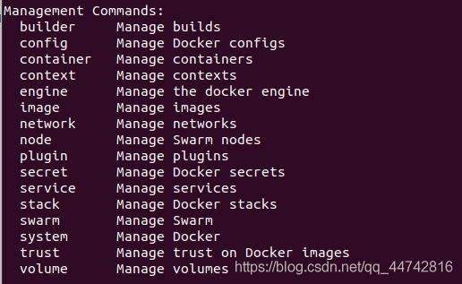

- 2.1 image–镜像
    - 2.1.1：认识 -镜像是由多层只读的特殊文件系统构成（docker images 查看系统中的镜像）
    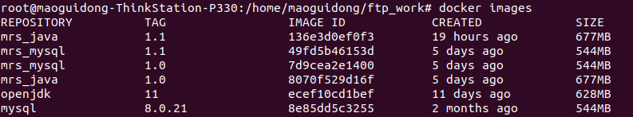
    - 2.1.2：获取镜像的方式一般有两种方式
        ```text
	    一：使用docker pull命令直接从远程镜像仓库获取（docker pull openjdk:11--从仓库拉取一个tag为11的opjdk）
	    二：使用docker build命令利用本地Dockerfile文件自己构建一个docker 镜像（后面再细说）
	    三：使用docker commit 命令在本地现在容器中生成一个新镜像。
        ```
    - 2.1.3：镜像的常用命令
        ```shell
            docker  images:查看系统中的所有镜像
	        docker rmi 镜像包名/镜像id:删除一个系统中的镜像
	        docker rmi $(docker images -q):删除系统中所有的镜像 
	        docker rmi -f $(docker images -q):强制删除	
        ```
- 2.2 container–容器
    - 2.2.1:容器是镜像一个实例，可以使用docker exec进入容器，发现容器内部就是一个虚拟的linux系统;
        ```shell
	        使用docker run 一个镜像生成一个容器实例，镜像是多层只读的文件系统，但是容器提供了可操作的空间。
        ```
        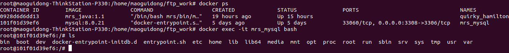

    - 2.2.3:容器的常用指令
        ```shell
	        docker inspect 容器id/容器名：查看容器的详细信息，如数据挂载情况，网络等
	        doceker ps: 列出正在运行的docker 容器
	        docker ps -a:列出所有的docker 容器
	        docker exec -it 容器名 /bin/bash: 进入一个容器实例
	        docker container stop 容器id/容器名：停止一个正在运行的容器
	        docker container start 容器id/容器名：启动一个容器
	        docker container restart 容器id/容器名：重启一个容器
	        docker rm 容器id/容器名:删除一个容器
	        docker container prune:删除所有停止运行的容器
	        docker rm $(docker ps -aq):删除所有的容器
	        docker commit :在当前容器的基础上生成一个新的镜像
        ```
- 2.3 network --网络

    - 2.3.1：docker 网络是docker 在宿主机上虚拟出了一个docker0的网卡，然后容器内的所有网络交互就是通过这个docker0网卡，
        ```shell
        可以通过ifconfig可以发现多了一个docker0网卡。
        ```
    - 2.3.2：docker 的网络类型(docker network ls)
        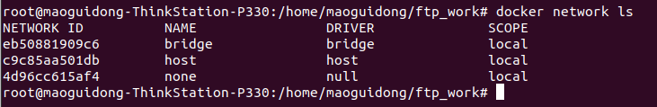
        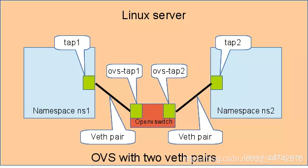
        ```shell
			bridge:桥接模式（启动容器时默认的方式，创建一对veth-pair虚拟接口用于实现容器和容器之间的通信。
			host:宿主机模式,顾名思义就是直接使用宿主的网络
			none:没有网络，不能通过宿主机访问容器内部
        ```

    - 2.3.3 ：docker网络的常用命令（docker network --help）
        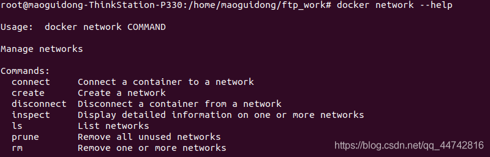
        ```shell
	        disconnect:将容器里面的网路拔掉
	        connect:重新给容器创建一个指定类型的网络
	        create:创建一个自定义的bridge类型的网络---目的是为了可以使用容器名直接通信（后面细讲）
	        inspect:显示网络类型各有哪些容器在使用
        ```
    - 2.3.4:docker网络核心-容器之间的通信
	    - 1.随便创建两个镜像image_a和image_b
            

        - 2.启动这两个镜像什么都不干，分别命名为container_a,container_b
            ```shell
			docker run --name container_a -itd images_a:1.0 bash
			docker run --name container_b -itd images_b:1.0 bash
            ```
            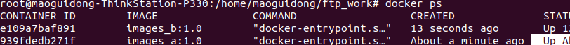

			此时通过ifconfig命令发现宿主机中多个两个veth-pair的接口
            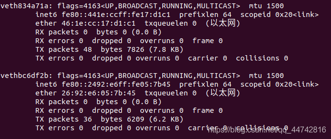
	    - 3.查看网络（docker inspect container_a）
            ```shell
			container_a的ip为:172.17.0.3(并网关为docker0的ip)
			container_b的ip为:172.17.0.4(并网关为docker0的ip)
            ```
            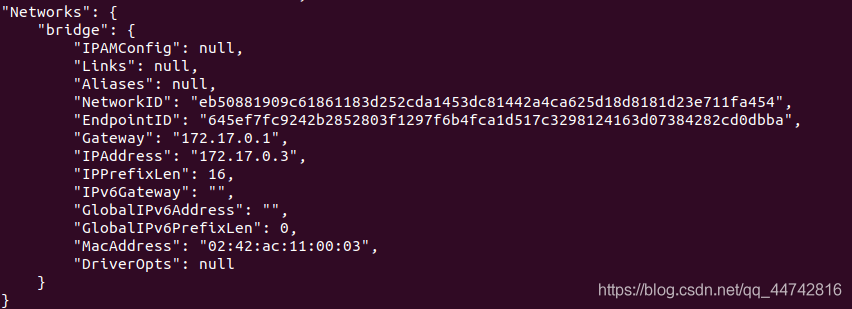
	    - 4.进入容器container_a（docker exec -it container_a bash）ping container_b的ip
            
	    - 5.安装
            ```shell
		    ping (apt install inetutils-ping -y)------------------ifconfig  (yum install net-tools -y)  
		    
            ping 一下container_b的ip为:172.17.0.4
            ```
            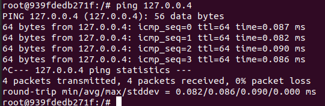

	    - 6.结论和问题	
            ```shell
			发现可以ping通，证明两个容器之间是可以通过ip互相通讯的。
			问题？container_a和container_b一般是独立的服务，如果要实现互相通信，在启动容器时ip是随机分配的，
				那容器a是否能通过容器名直访问容器呢？
				同理在容器a中ping container_b
            ```
            
            ```shell
			发现并不能直接通过容器名访问另一个容器，但是docker 提供了两种解决方式
			方式一：通过运行容器时link另外一个容器（a link b只能单向的a通过b的容器名访问b，官方不推荐,不再维护，其原理就是在a容器的/etc/hosts文件中增加b的容器名和ip实现类似localhsot解析为127.0.0.1）
			方式二：通过自定义网络，并把这两个网络加入到同一个自定义网络中
			方式二实现：
				
                    1.创建自定义网络docker network create maobridge
            ```
            
            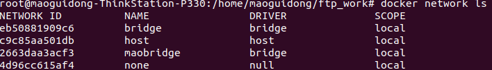
            
            ```shell
				    2.将容器container_a和container_b加入到自定义的网络中
						docker network connect maobridge container_a
						docker network connect maobridge container_b
						docker network inspect maobridge查看自定义网络发现两个容器都已经加在这个网络中
            ```
            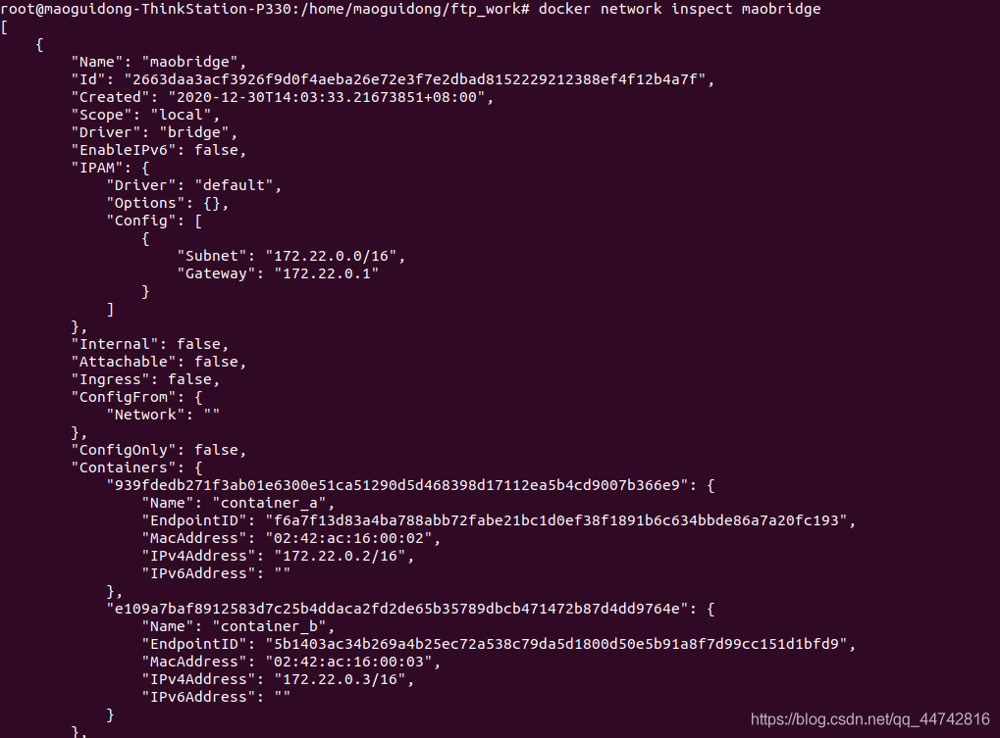
            ```shell        
	                3.重新进入container_a ping container_b（docker exec -it container_a bash）
            ```
            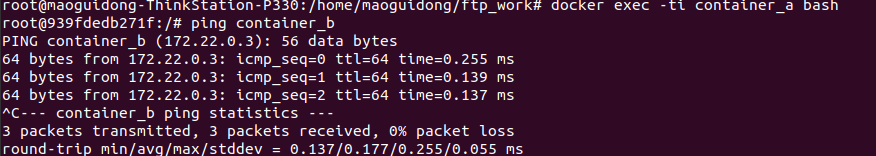


- 2.4 volume–数据卷
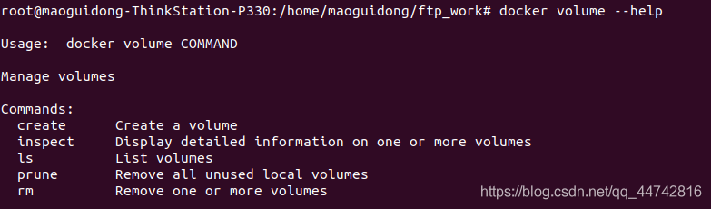

    - 2.4.1 ：docker数据卷的出现是为了持久化，不至于随着docker容器的消亡它的数据也随之消亡
        ```sehll
	    可以通过docker inspect containerid查看当前容器的数据的挂在情况
        ```
        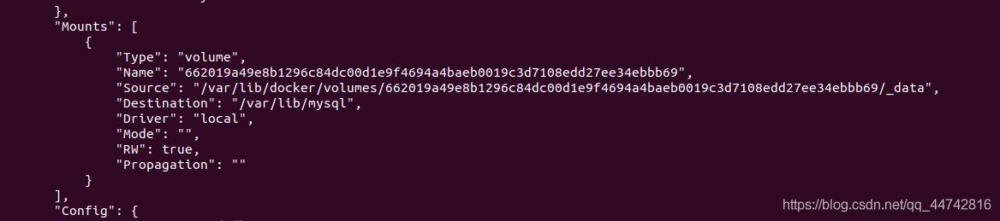
        ```shell
	    随着docker run 就会在宿主机的/var/lib/docker/volumes/下面生成一个默认类型为volume的随机数据卷
	    可以通过docker volume ls查看宿主机所有的volumes情况
        ```
        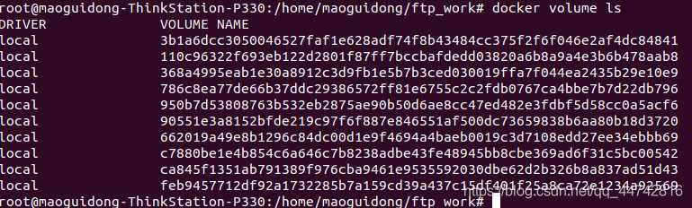
        ```shell
	    也可以自己定义一个volume,(docker volume create my_volume)运行镜像的时候指定自己命令的volume
        ```
        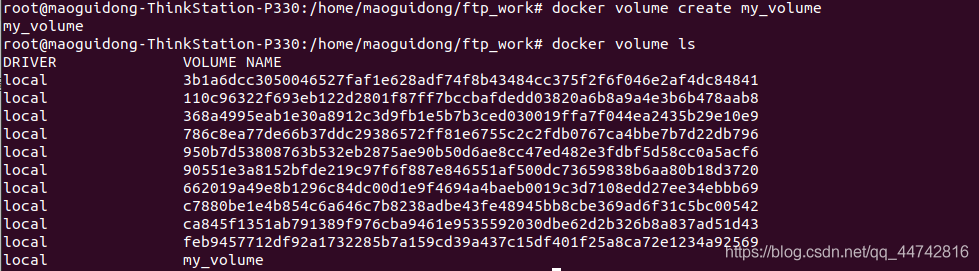

    - 2.4.2容器数据持久化分类
        ```shell
	        1.	volume 数据卷（docker默认的一种数据存储方式）
	        2.	 bind	双向绑定宿主机文件
	        3.	tmpfs   容器内临时文件，随着停止容器数据会被自动清除	
        在启动容器时可以通过-v或者--volume指定挂载类型,官方推荐更加详细的--mount命令来指定启动镜像 的配置数据持久方式（后面运行镜像在细说）
        ```
---
## 3.docker 命令 docker --help
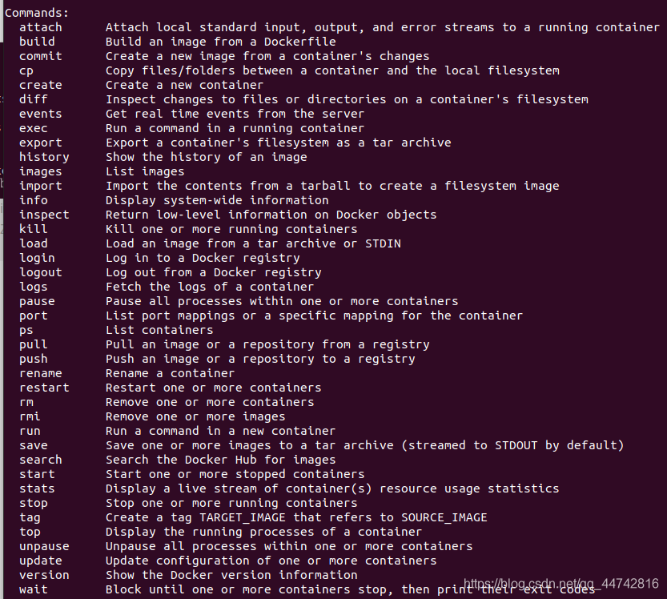
- 3.1 docker build–构建自定义镜像
    - 3.1.1Dockerfile文件
        ```shell
        #名字，名字可以随意取，可以叫mydockerfile 或者myfile只是当时用docker build .命令时，
	    #默认查找当前目录下名为Dockerfile的文件作为启动文件，如没找到则报错，自定义名称可以用docker build -f myfile . 指定构建
	
        FROM image_name:tag  定义使用哪个基本镜像启动构建流程 
        MAINTAINER user_name  声明镜像的创建者。版权声明
        ENV key value  添加环境变量 这个可以写多个
        RUN command  表示要执行的命令 这个是核心内容 可以写多条
        ADD source_dir/file dest_dir/file  将宿主机的文件复制到容器中 如果是压缩文件的话 会自己解压
        COYP source_dir/file dest_dir/file  同ADD 就是不会解压
        WORKDIR path_dir  工作目录 就是这样命令执行的目录 登录容器后也在这个目录	
        CMD 容器启动后要处理的命令
        ```
        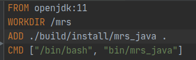
    - 3.1.2构建一个镜像mrs_test版本为1.0
        ```shell
        运行 docker build -t mrs_test:1.0 
        ```
        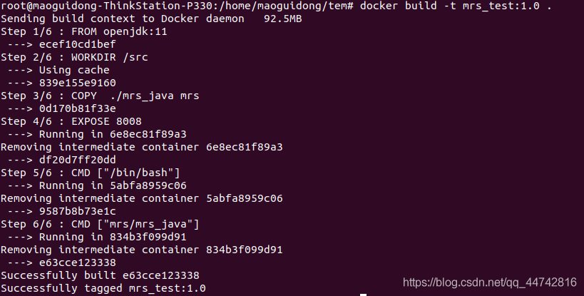
        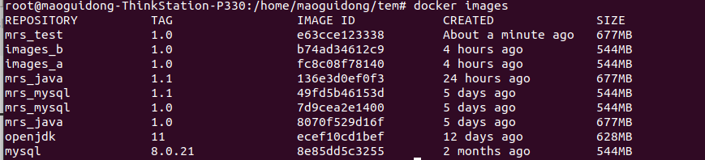

- 3.2 docker run–运行一个镜像并生成一个容器实例（类似于通过一个类生成一个对象）
    - 3.2.1运行一个镜像指定网络，指定容器名，指定数据持久类型
        ```shell
		运行刚才创建的mrs_test:1.0镜像生成的容器名为：mrstest1  (--name mrstest1)
		指定使用刚才创建的mgdbridge网路中 				 ：--network mgdbridge
		指定数据持久的类型为volume并且使用自己创建的my_volume
		-it:交互式运行
		-d:后台运行
		bash:跟Dockerfile中的CMD命令一样，并且替换Dockerfile中Cmd命令，运行现在写的bash命令
		
		docker run --name mrstest1 --network maobridge --mount type=volume,source=my_volume,destination=/mrs -itd mrs_test:1.0 /bin/bash
        ```
        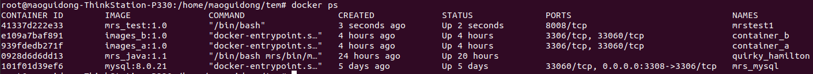
         ```shel   
	    查看当前容器挂载信息和网络信息
        ```
        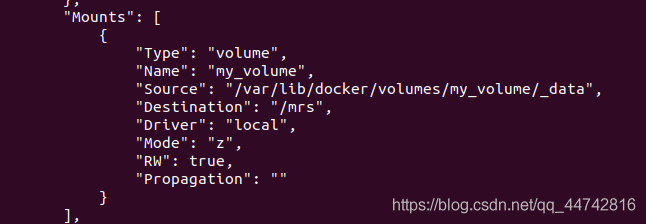
        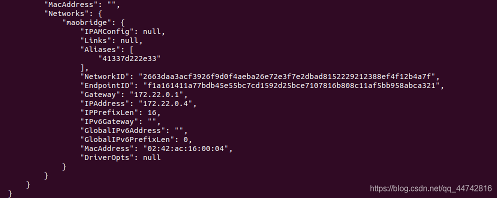
    - 3.2.2重新运行这个镜像并将制定挂载类型为bind
        ```shell
	    指定数据持久的类型为bind,并绑定到宿主机
		docker run --name mrstest2 --network maobridge --mount type=bind,source=/home/maoguidong/tem/temp,destination=/mrs/temp -itd mrs_test:1.0 /bin/bash
        ```
         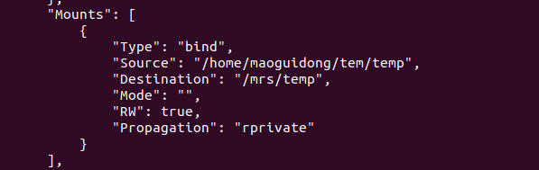
        ```shell
	    进入容器在/mrs/temp下面创建一个文件夹containertest
        ```
        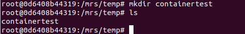
        ```shell
	    进入宿主机/home/moaguidong/tem/temp,发现了容器创建中创建的文件containertest 
        ```
         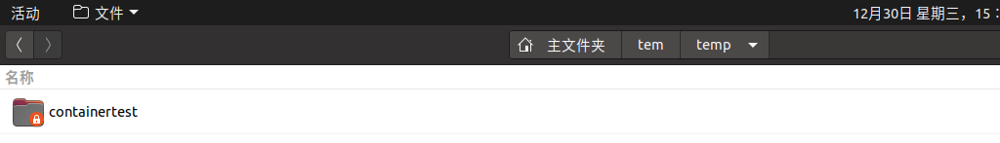

# docker 进阶

## Docker architecture
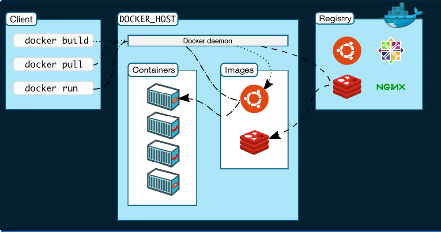
## Docker 学习目标-学会使用docker构建(build)，运行(run)，部署服务(deploy)。
### [1-使用 Docker 容器化特定语言的应用程序](https://docs.docker.com/language/)
### [2-使用命令行构建并运行镜像](https://docs.docker.com/engine/reference/commandline/run/)
### [3-编写一个 Dockerfile构建运行应用程序](https://docs.docker.com/engine/reference/builder/)
### [4-使用多阶段构建镜像](https://docs.docker.com/develop/develop-images/multistage-build/#stop-at-a-specific-build-stage)
### [5-使用docker-compose 同时启动多个依赖应用程序](https://docs.docker.com/compose/compose-file/compose-file-v3/)
### [6-使用swarm弹性部署应用](https://docs.docker.com/engine/swarm/swarm-tutorial/create-swarm/)
### [7-管理容器网络](https://docs.docker.com/network/)
### [8-使用volumes卷持久化容器数据](https://docs.docker.com/storage/volumes/)
### [9-使用docker仓库存储镜像](https://docs.docker.com/registry/)

---

## 1.通过命令行部署运行容器

## 2.通过dockerfile快速部署一个容器
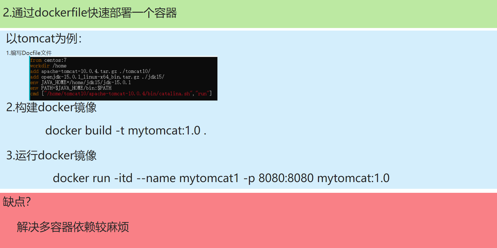
## 3.通过docker-compose一键部署多个容器
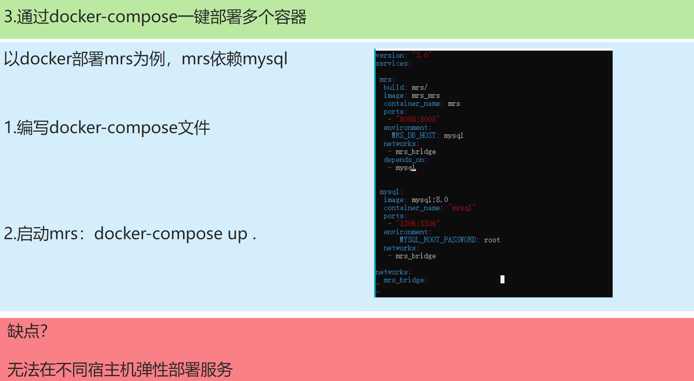
## 4.通过docker swarm弹性部署服务
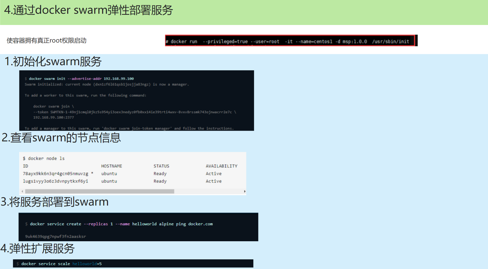
## 5.docker网络
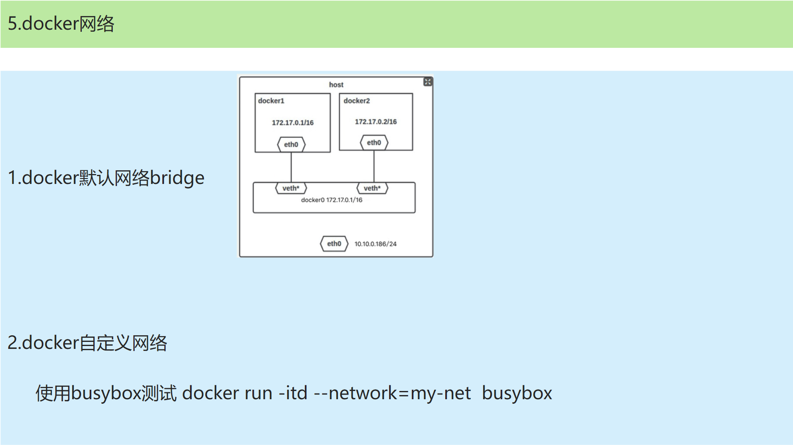
## 6.docker Volumes数据卷
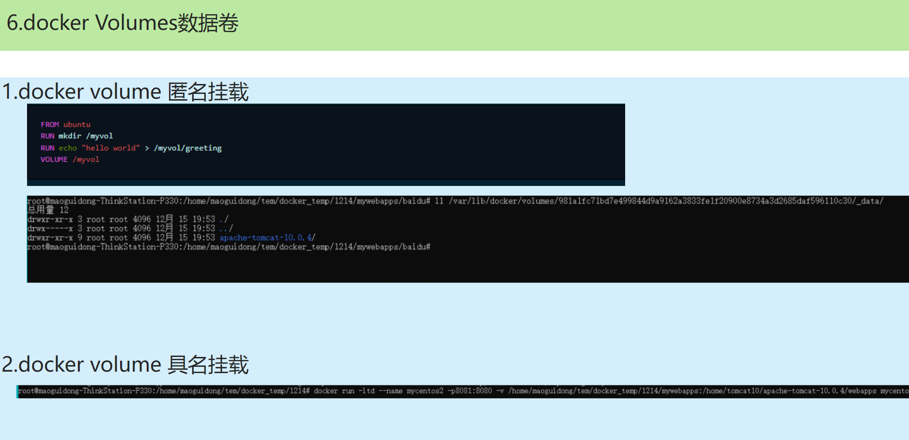
## 7.docker registry私有仓库
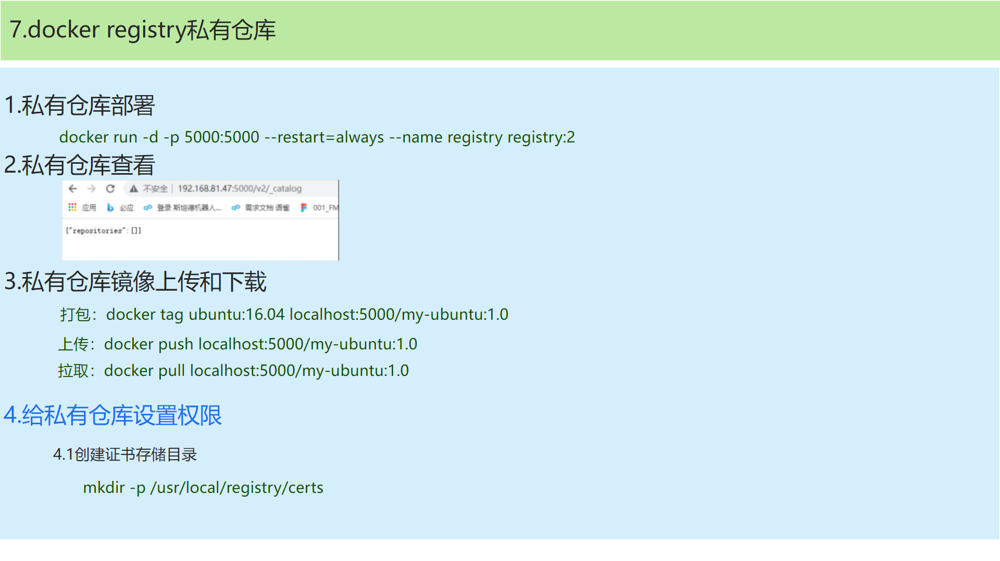
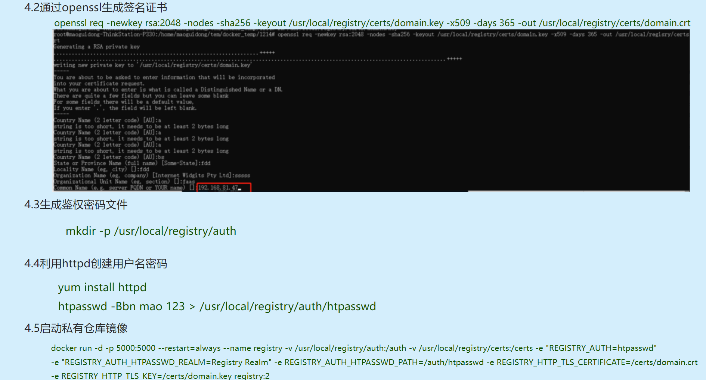
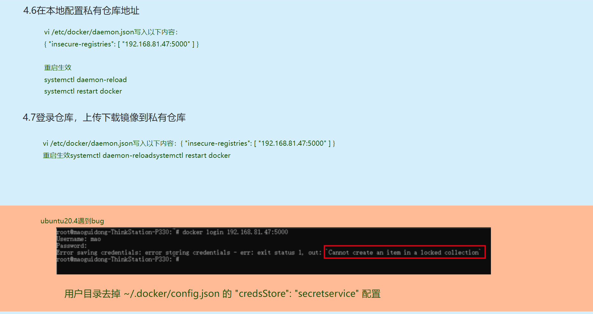
## 8.docker 镜像迁移
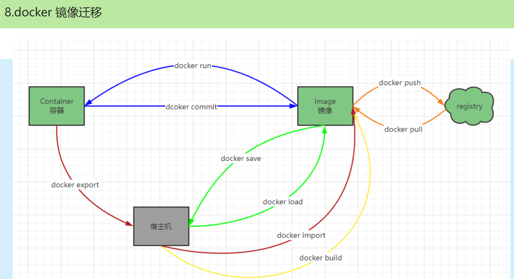